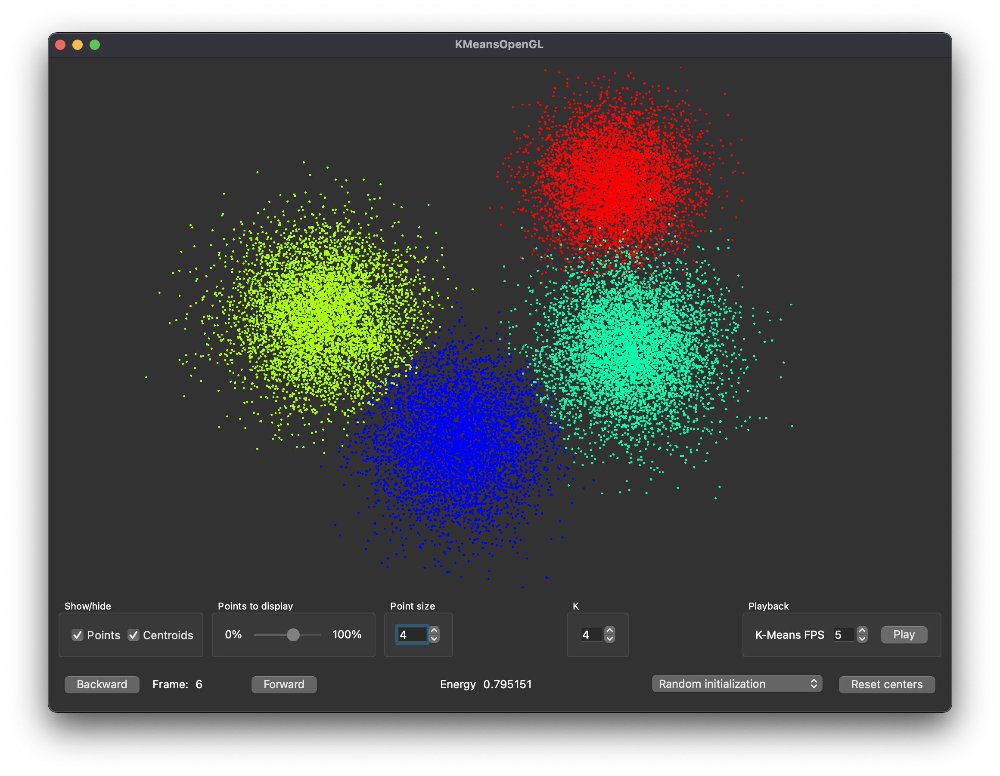

# Interactive K-Means with Qt and OpenGL
Interactive K-Means with Qt and OpenGL, written in C++.

## Running the code in [Qt Creator](https://www.qt.io/product/development-tools)

Running this code requires [Qt Creator](https://www.qt.io/product/development-tools). 

1. Open Qt Creator. Go to File->Open File or Project...
2. then navigate to the project you wish to open and click on the .pro file (i.e., KMeansOpenGL.pro). Note, if you open the .h files or .cpp files instead it will not open the entire project.

You can then build and run the code inside of Qt Creator ([tutorial[(https://stanford.edu/class/archive/cs/cs106b/cs106b.1154/qtcreator/qtcreator.html)).

## Built With

* [Qt](https://www.qt.io/) 
* [Qt Creatoe](https://www.qt.io/product/development-tools/) 

## Authors

* **Imad Eddine Toubal** - *Initial work* - [imadtoubal](https://github.com/imadtoubal)

## License

This project is licensed under the MIT License - see the [LICENSE](LICENSE) file for details
